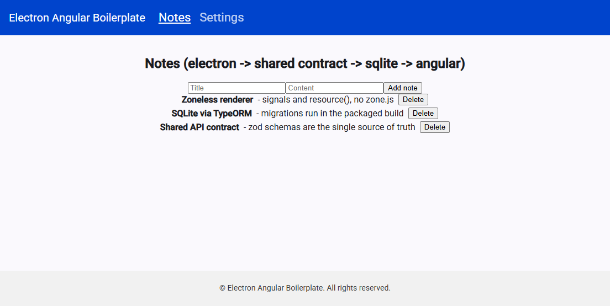
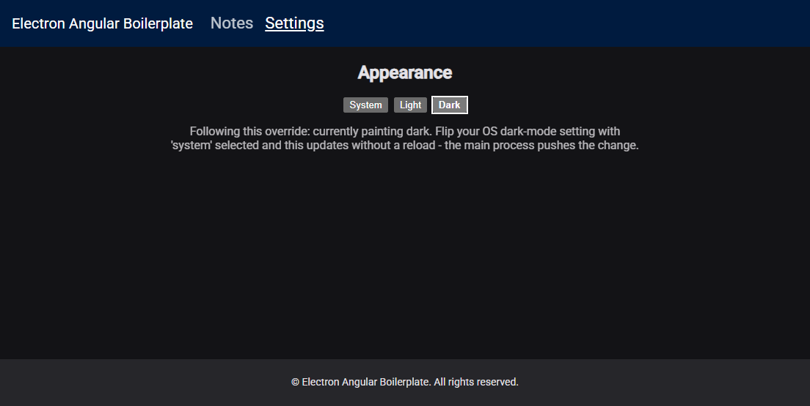

# Electron + Angular Boilerplate

[](https://github.com/skelesp/electron-angular-boilerplate/actions/workflows/ci.yml)
[](https://github.com/skelesp/electron-angular-boilerplate/actions/workflows/codeql.yml)
[](LICENSE)
[](.nvmrc)
[](https://angular.dev)
[](https://www.electronjs.org)

A desktop app built on Angular, Electron and SQLite: Angular frontend (renderer), Electron
main process, a SQLite database via TypeORM, and a **shared, runtime-validated API contract**
between the two (zod schemas double as the source of truth for the TypeScript types, the IPC
input and output validation, and the payloads of main-process events).

Zoneless Angular, a sandboxed and channel-allowlisted preload bridge, TypeORM migrations that
actually run inside the asar, GitHub-Releases auto-update, and cross-platform packaging with a
Playwright suite that runs against the **packaged** app on Windows, macOS and Linux in CI.

<!-- template-only:start -->

## What it looks like

The bundled example: two API domains end to end - `note` (SQLite-backed CRUD plus a
main → renderer `note.changed` event) and `theme` (no database at all, its store is the OS).



The `/settings` route is lazily loaded and hash-routed, and writes through to Electron's
`nativeTheme`, so the native window chrome follows the app - not just the CSS.



## Starting a project from this template

This is a **template repository**. Click "Use this template" on GitHub to start a new,
fully independent project from it - the new repo has no shared history or dependency
on this one, so upgrading this boilerplate later (Angular, Electron, TypeORM, ...)
never affects projects already created from it.

```
npm run init
npm install
npm start
```

`npm run init` asks for a product name, an npm scope and a few other details, then rewrites
this template's identity into yours: the window and installer name, the electron-builder
`appId`, the `@electron-angular-boilerplate/shared` scope every workspace imports by, the
SQLite filename, the `LICENSE` copyright line and this readme. It runs on plain Node with no
dependencies, so **run it before `npm install`** - renaming the shared package invalidates
the workspace symlinks an earlier install created.

It is scriptable too, for forks that are set up automatically:

```
npm run init -- --name "Acme Notes" --author "Acme Inc." --yes
npm run init -- --name "Acme Notes" --dry-run   # list the files it would touch
```

Everything it changes is a rename. Deciding what your app actually _is_ starts at
"Adding a new API domain" below - the bundled `note` and `theme` domains are examples to
replace, not scaffolding to keep.

<!-- template-only:end -->

## Project structure

```
/
├── workspaces/
│   ├── angular-app/     # Angular frontend (renderer process)
│   ├── electron-app/    # Electron main process + SQLite/TypeORM
│   └── shared/          # API contract: zod schemas, types, IPC channel registry
├── package.json         # npm workspaces root
└── tsconfig.json
```

### How the API contract works

The contract has two halves: **request/response** (the renderer asks, the main process
answers) and **events** (the main process pushes). Both are defined once in `shared` and
validated at the process boundary.

**Request/response**

- `shared/src/apiDefinition/<domain>/types.ts` defines zod schemas (and the types
  inferred from them) for one domain's input/output.
- `shared/src/apiDefinition/<domain>/endpoints.ts` maps each action to an IPC channel
  name and its schemas.
- `shared/src/apiDefinition/registry.ts` combines every domain into `apiRegistry`
  (runtime) and `AppApiRegistry` (compile-time).
- `electron-app`'s `handlersRegistry.ts` validates every incoming IPC payload against
  its channel's zod schema before the handler runs, validates the response against the
  channel's output schema on the way back (in development builds), and always returns an
  `ApiResponse<T>` envelope (`{status: 'success', data} | {status: 'error', error}`) -
  handlers themselves can just throw.
- `angular-app`'s `ElectronService.invoke(channel, data)` is fully typed against
  `AppApiRegistry`, so a mismatched payload or channel is a compile error, not a
  runtime surprise.

**Events (main process -> renderer)**

- `shared/src/apiDefinition/<domain>/events.ts` defines a channel name and a payload
  schema per event; `registry.ts` collects them into `eventRegistry` / `AppApiEvents`.
- `electron-app`'s `emitAppEvent(channel, payload)` broadcasts to every open window,
  validating the payload against its schema in development builds.
- `angular-app`'s `ElectronService.on(channel, listener)` subscribes and returns an
  unsubscribe function. The preload bridge allowlists event channels the same way it
  allowlists `invoke` channels.

**Handlers return DTOs, not entities.** Each domain has a `<Domain>.mapper.ts`
(`toNoteDto`) that maps its TypeORM entity to the DTO the contract declares. Returning
the entity would type-check for as long as the two shapes agree - and then quietly ship
the next internal `@Column()` someone adds straight to the renderer. Output DTO schemas
are `z.strictObject`s and outputs are validated in development, so a domain that forgets
the mapper fails loudly instead.

**Errors carry named codes**, not HTTP status numbers: `ApiErrorCode.NOT_FOUND`,
`VALIDATION_FAILED`, `INTERNAL`, and so on. A handler picks one by throwing
`new ApiError(ApiErrorCode.NOT_FOUND, 'Note not found')`; anything else it throws
becomes `INTERNAL`. The renderer can `switch` on the code.

Two example domains are included end-to-end. `note` (create/get/list/delete, plus a
`note.changed` event) is the full stack: shared schema, TypeORM entity/repository/mapper/handler,
Angular service, `NotesComponent`. `theme` is the same contract with no database behind it -
its store is the OS, read and written through Electron's `nativeTheme`, so the app follows your
system dark-mode setting and can override it. Replace them with your own domain(s).

## Adding a new API domain

**Shared**

1. Create `shared/src/apiDefinition/<domain>/types.ts` and `endpoints.ts`.
2. Define the input/output zod schemas in `types.ts` (output DTOs as `z.strictObject`).
3. Define the channel names and endpoint registry in `endpoints.ts`.
4. Add the domain to `apiRegistry` and `AppApiRegistry` in `registry.ts`.
5. If the domain pushes events, add `events.ts` and register it in `eventRegistry` /
   `AppApiEvents` too.

**Electron app**

6. Create the TypeORM entity/repository under `electron-app/src/models/<domain>/`.
7. Add the entity to `entities` in `database/sqlite.config.ts`.
8. Add a `<Domain>.mapper.ts` converting the entity to the contract's DTO.
9. Create a `<domain>.handler.ts` implementing one handler per endpoint. Resolve
   repositories through `getDataSource()` inside the handler, never at module load - that
   is what keeps the domain unit-testable without mocking Electron. Throw `ApiError` for
   outcomes the contract documents; emit events with `emitAppEvent`.
10. Spread the handler's exported object into `handlersRegistry` in `handlersRegistry.ts`.

Steps 6-8 only apply to a domain that persists something. A domain backed by the OS, a file
watcher or a remote service just needs the handler (see `models/theme/theme.handler.ts`).

**Angular app**

11. Add a `<domain>.service.ts` under `services/` that calls `ElectronService.invoke(...)`,
    and subscribes with `ElectronService.on(...)` if the domain has events. Load through
    `resource()` and expose plain signals (`notes`, `loading`, `error`) rather than doing
    async work in the constructor.
12. Use it from a component.

## The Angular renderer

- **Zoneless** (`provideZonelessChangeDetection()`, no `zone.js` anywhere). State a template
  reads has to be a signal - that is the one rule this imposes.
- **`resource()`** for anything loaded asynchronously, so services don't do async work in their
  constructors and their loading/error state isn't hand-rolled.
- **`provideBrowserGlobalErrorListeners()`**, because in a packaged app nobody has DevTools open
  to catch what would otherwise be lost.
- **Routing with `withHashLocation()`** and one lazily loaded route (`loadComponent`) as the
  worked example. Hash routing is required, not stylistic: a packaged build is served from
  `file://`, where the path strategy's pushState URLs can't be reloaded.
- **Dark mode** that follows the OS, applied by writing `color-scheme` onto `<html>` from what
  the main process reports, with `light-dark()` values in the stylesheets. The `/settings` route
  can override it; the native window chrome follows along because `nativeTheme` is the source of
  truth.

## Development

### Prerequisites

- [Node.js](https://nodejs.org/) 22 or newer — the version in [`.nvmrc`](.nvmrc), and what CI
  runs. `nvm use` (or `fnm use`) picks it up.
- npm 10 or newer. Both are declared in the root `package.json`'s `engines`.

### Getting started

```
npm install
npm start
```

This runs the shared package in watch mode, `ng serve`, and Electron concurrently.
The Electron window loads `http://localhost:4200`.

### Useful scripts

Run from the repository root.

**Build**

- `npm start` — builds `shared`, then runs its watcher, `ng serve` and Electron together
- `npm run build` — builds `shared`, `electron-app` and `angular-app` in dependency order, then
  copies the Angular output into `electron-app/renderer/`
- `npm run build:shared` / `build:electron-app` / `build:angular-app` — one workspace
- `npm run clean` — removes every workspace's build output

**Check**

- `npm run lint` / `npm run lint:fix` — ESLint across all workspaces (compiles `shared` first,
  which a fresh checkout needs before cross-workspace imports resolve)
- `npm run format` / `npm run format:check` — Prettier over the whole repo
- `npm run test` — Vitest suites for `shared`, `electron-app` and `angular-app`
- `npm run test:coverage` — the same suites with coverage reports under each `coverage/`
- `npm run coverage:summary` — renders those totals as a markdown table
- `npm run test:e2e` — packages the app and runs the Playwright suite against the **packaged**
  build (slow; also runs in CI on all three platforms)

**Ship**

- `npm run package:dir` — the packaged app tree without an installer, much faster
- `npm run package` — a real installer under `/release`

**Per workspace** — `npm --workspace=workspaces/<name> run <script>`:

- `electron-app`: `bundle:preload` (esbuild; see below), `migration:generate` /
  `migration:run` / `migration:revert`
- `shared`: `watch` (`tsc --build --watch` over both of its projects)
- `angular-app`: `start` (`ng serve`), `watch` (`ng build --watch`)

### `shared` is built twice

`shared` is the one package both processes import, and they want different module formats: the
Angular renderer wants ESM (CommonJS costs it optimization bailouts), while the Electron main
process is CommonJS and must stay that way. So it compiles to both — `dist/cjs` from
`tsconfig.json`, `dist/esm` from `tsconfig.esm.json` — and the `exports` map in its
`package.json` gives each consumer the right one. You don't have to think about it day to day;
one thing does carry over into how you write code there:

**relative imports inside `shared/src` need an explicit `.js` extension** (`'./registry.js'`,
and `'./apiDefinition/index.js'` for a directory). TypeScript still resolves those to the `.ts`
source; Node's ESM loader is what requires them.

### The preload script is bundled, not just compiled

`webPreferences.sandbox` is `true`, and a sandboxed preload script can only `require()` Node
builtins and `electron` — not an arbitrary npm package. So `preload.ts` cannot be shipped as a
plain `tsc` output: its import of `isValidChannel` from `shared` would fail to resolve at
runtime, and the whole IPC bridge would silently not exist.

`electron-app`'s `bundle:preload` script (esbuild, `--bundle --platform=node --format=cjs
--external:electron`) inlines those dependencies into a single `dist/preload.js`. It runs as
part of both `start` and `compile`, so you never call it by hand — but **if you change how
`preload.ts` is built, that constraint is what you have to preserve.**

## Contributing

[CONTRIBUTING.md](CONTRIBUTING.md) covers the setup, the checks CI runs, and the conventions
worth knowing before a pull request. Commit messages follow
[Conventional Commits](https://www.conventionalcommits.org/), enforced by a `commit-msg` hook;
Prettier runs on staged files on `pre-commit`. Both hooks are installed by husky on
`npm install` — `git commit --no-verify` skips them if you need to.

Also: [CODE_OF_CONDUCT.md](CODE_OF_CONDUCT.md), [SECURITY.md](SECURITY.md) (report
vulnerabilities privately, not as an issue), and [CHANGELOG.md](CHANGELOG.md).

## CI

`.github/workflows/ci.yml` runs on every push to `main` and every pull request:

| Job       | Where                  | What                                                          |
| --------- | ---------------------- | ------------------------------------------------------------- |
| `verify`  | ubuntu                 | lint, format check, build, unit tests + coverage summary      |
| `package` | windows, macOS, ubuntu | packages the app and runs the Playwright e2e suite against it |
| `audit`   | ubuntu                 | `npm audit` (advisory — it reports, it doesn't block)         |

The `package` job is the important one. Cross-platform Electron packaging is the part of a
desktop app that actually breaks — native modules, module resolution inside the asar, a preload
script that fails under `sandbox: true`, a CSP that only applies in a packaged build — and none
of it is reachable by building from source on one machine. It runs on all three platforms so
you find out on the PR rather than after a release.

`.github/workflows/codeql.yml` adds GitHub's CodeQL analysis for JavaScript/TypeScript on
push, PR and weekly.

## Releasing

`.github/workflows/release.yml` is triggered by a `v*` tag and builds a real installer on each
platform — NSIS on Windows, dmg + zip on macOS, AppImage on Linux — attaching them all to a
**draft** GitHub Release:

```
npm version <major|minor|patch>   # or edit workspaces/electron-app/package.json
git tag v1.2.3 && git push origin v1.2.3
```

Then open the draft release Actions created for you, review the auto-generated notes, and
publish it when you're ready. Nothing reaches users until you do. The tag is the source of
truth for the version — the workflow writes it into the app before building — and the only
credential involved is the `GITHUB_TOKEN` Actions provides automatically, so this works on a
fresh fork with no setup.

No code signing is configured. See the "Auto-update" section of `CLAUDE.md` for what to add and
which secrets electron-builder expects.

## Auto-update

The app checks GitHub Releases for a newer version on startup and every six hours after that,
downloads it in the background and offers a "Restart now / Later" prompt when it's ready
(`workspaces/electron-app/src/updater.ts`, using `electron-updater`). It resolves the repo it
was built from automatically, so a fork updates from the fork's own releases.

It quietly does nothing in development and in `--dir` builds, which have no update feed, and
never takes the app down when a check fails. Two things you have to supply before updates
actually reach users:

1. **A published (non-draft) release** — electron-updater can't read drafts.
2. **Code signing.** On macOS it's mandatory: an unsigned or un-notarized build can't be
   swapped in by Squirrel.Mac, so auto-update will always fail. On Windows updates work
   unsigned but SmartScreen warns users. Linux AppImage needs neither.

`CLAUDE.md` documents how to wire signing in, and how to remove auto-update entirely if you'd
rather not ship it.

## Staying current

Dependabot is configured in `.github/dependabot.yml` and runs weekly once you've created a
repo from this template — no app to install. Angular, the lint toolchain, the test toolchain
and the electron-builder/electron-updater pair are grouped into one PR each; `electron` and
`better-sqlite3` majors are left for you to take by hand, since they move native/ABI ground
that CI only partly covers (it packages, but builds no signed installers).

## License

[MIT](LICENSE)
